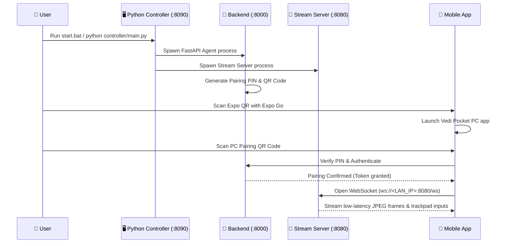
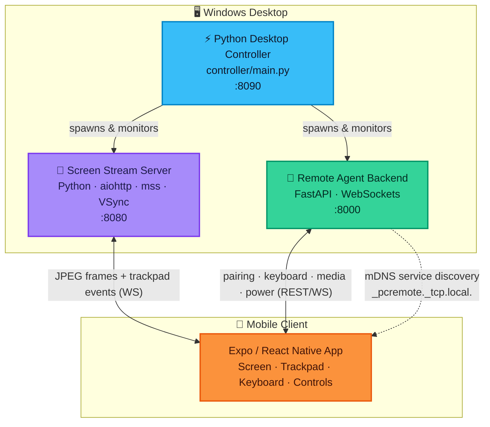

<div align="center">


<br/>


<br/>


</div>


## ✨ Overview

**Vedi Pocket PC** turns your phone into a wireless trackpad, keyboard, and live screen for your desktop PC — streamed entirely over your **local Wi-Fi network**. No accounts, no third-party servers, no cloud relay, and zero internet dependency. 

Scan a QR code on your PC screen and immediately take remote control.

<div align="center">
<table>
<tr>
<td align="center" width="25%">

### 🖥️
**Screen Mirror**
Low-latency JPEG stream over WebSockets with VSync alignment (<30ms)

</td>
<td align="center" width="25%">

### 🖱️
**Trackpad**
Move · Left/Right Click · Press & Drag · Smooth Scroll

</td>
<td align="center" width="25%">

### ⌨️
**Keyboard**
Full soft keys + shortcut bar (Ctrl, Alt, Win, Del)

</td>
<td align="center" width="25%">

### ⚡
**Power & Media**
Lock · Sleep · Shutdown · Mute · Volume Control

</td>
</tr>
</table>
</div>


## 📋 System Requirements

| Component | Requirement | Notes |
|:---:|:---:|:---|
| **OS** | Windows 10 / 11 | Host desktop machine |
| **Python** | 3.10 or higher | Powers the desktop controller, backend agent & screen stream server |
| **Node.js** | v18.0 or higher | Required only to bundle the Expo dev server for mobile |
| **Network** | Local Wi-Fi (LAN) | Phone & PC must be on the same local Wi-Fi router |
| **Mobile** | Expo Go App | Available free on iOS App Store & Android Google Play |


## 🚀 Quick Start Guide

### ⚡ Option A — 1-Click Automated Setup (Recommended)

1. **Install All Dependencies**:
   Double-click **[`setup.bat`](file:///P:/Vedi-Pocket-PC/setup.bat)** (or run `.\setup.bat` in PowerShell).
   > *This script automatically checks Python & Node, installs all Python packages and mobile Expo packages.*

2. **Launch the Application**:
   Double-click **[`start.bat`](file:///P:/Vedi-Pocket-PC/start.bat)** (or run `python controller/main.py`).
   > *Launches the Python desktop controller (:8090), starts Screen Streamer (:8080), Remote Agent (:8000), and Mobile Expo Dev Server (:8088).*

3. **Connect Mobile App**:
   - Open **Expo Go** on your phone.
   - Scan the **Expo QR Code** shown in your desktop UI / terminal.
   - Once inside the mobile app, scan the **PC Pairing QR Code** to connect!

---

### ⚙️ Option B — Manual Step-by-Step Installation

<details>
<summary><b>Click to expand manual setup instructions</b></summary>

<br/>

#### 1️⃣ Install Python Dependencies
```powershell
pip install -r requirements.txt
```

#### 2️⃣ Install Mobile Client Dependencies
```powershell
cd veddi-pocketpc
npm install --legacy-peer-deps
cd ..
```

#### 3️⃣ Launch Desktop Controller
```powershell
python controller/main.py
```

#### 4️⃣ Running Individual Services Separately
If you prefer running backends manually in individual PowerShell windows:

- **Screen Stream Server** (Port `8080`):
  ```powershell
  cd screen-stream-server
  python main.py
  ```

- **FastAPI Remote Agent Backend** (Port `8000`):
  ```powershell
  cd vedi-pocketpc-backend
  python main.py
  ```

- **Mobile Client Expo App** (Port `8088`):
  ```powershell
  cd veddi-pocketpc
  npx expo start -c
  ```

</details>


## 📱 How to Pair Mobile App with PC



1. Make sure your **Phone and PC are connected to the same Wi-Fi**.
2. Run `start.bat` on your PC.
3. Open **Expo Go** on your phone:
   - **Android**: Scan the terminal QR code inside Expo Go.
   - **iOS**: Scan the terminal QR code with your default Camera app, then tap "Open in Expo Go".
4. In the mobile app, tap **Pair Device** and point your camera at the **PC Pairing QR code** displayed on your desktop screen.


## 🧩 System Architecture




## 🗂️ Repository Structure

```text
Vedi-Pocket-PC/
├── setup.bat                          ⚡ One-click installer (Python + Expo dependencies)
├── start.bat                          🚀 One-click launcher (Python Controller + Backends + Expo)
├── main.py                            🐍 Root entry point
├── requirements.txt                   📦 Master Python dependencies file
├── controller/                        ⚡ Pure Python Desktop Controller (:8090)
│   ├── main.py                        Controller entry point & launcher
│   ├── process_manager.py             Process manager & log streamer
│   ├── server.py                      REST & WebSocket controller API server
│   ├── network.py                     LAN IP resolution & port finder
│   └── qr.py                          QR code generation
├── screen-stream-server/              📡 High-performance screen capture & trackpad server (:8080)
│   ├── domain/capture.py              Fast screen grabber (mss, Pillow 4:2:0 YUV)
│   ├── presentation/ws_router.py      Low-latency mouse & keyboard input WebSocket
│   └── main.py                        aiohttp server with 1ms high-res timer & VSync frame pacing
├── vedi-pocketpc-backend/             🔧 FastAPI remote management agent (:8000)
│   ├── presentation/                  Pairing, system info, power & media routes
│   ├── infrastructure/discovery.py    mDNS local network discovery broadcast
│   └── main.py                        FastAPI app entry point
├── veddi-pocketpc/                    📱 Expo / React Native mobile application (:8088)
│   ├── app/(tabs)/                    Screens: Home, Screen Mirror, Trackpad, Keyboard, Controls
│   ├── app/pairing.tsx                Camera QR code scanner screen
│   └── components/DesktopViewport.tsx VSync-aligned real-time desktop screen renderer
└── packages/agent-core/               🧠 Shared Python domain models & input drivers
```


## 🚨 Troubleshooting & FAQ

### 1. Windows Firewall Blocking Connection
If your phone cannot connect to the PC, open PowerShell **as Administrator** and allow inbound traffic on ports `8080`, `8000`, and `8090`:

```powershell
New-NetFirewallRule -DisplayName "Vedi Pocket PC - Screen Stream (8080)" -Direction Inbound -LocalPort 8080 -Protocol TCP -Action Allow -Profile Private,Domain
New-NetFirewallRule -DisplayName "Vedi Pocket PC - Backend Agent (8000)" -Direction Inbound -LocalPort 8000 -Protocol TCP -Action Allow -Profile Private,Domain
New-NetFirewallRule -DisplayName "Vedi Pocket PC - Controller (8090)" -Direction Inbound -LocalPort 8090 -Protocol TCP -Action Allow -Profile Private,Domain
```

### 2. `Port is being used by another process`
The controller automatically detects occupied ports and binds to the next available free port.


<div align="center">

### 📄 License

**MIT License** — See `package.json` for details.

</div>
