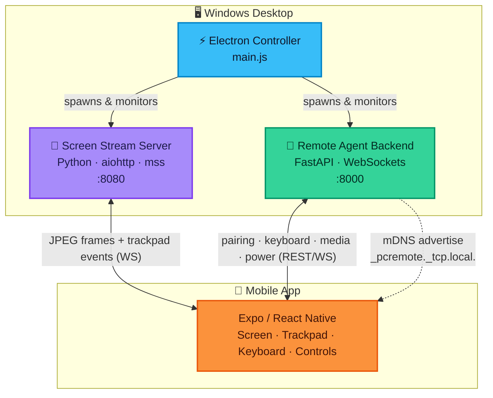
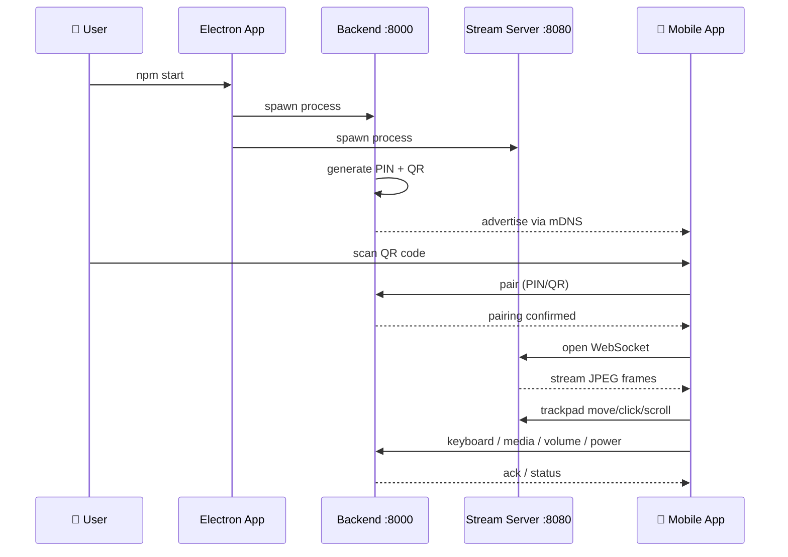

<div align="center">


<br/>


</div>


## ✨ Overview

**Vedi Pocket PC** turns your phone into a wireless trackpad, keyboard, and live screen for your desktop — streamed entirely over your **local Wi‑Fi**. No accounts, no cloud relay, no internet dependency. Pair with a QR code and you're in control.

<div align="center">
<table>
<tr>
<td align="center" width="25%">

### 🖥️
**Screen Mirror**
Low‑latency JPEG stream over WebSocket

</td>
<td align="center" width="25%">

### 🖱️
**Trackpad**
Move · Click · Drag · Scroll

</td>
<td align="center" width="25%">

### ⌨️
**Keyboard**
Soft keys + shortcut bar

</td>
<td align="center" width="25%">

### ⚡
**Power & Media**
Lock · Sleep · Shutdown · Volume

</td>
</tr>
</table>
</div>


## 🧩 Architecture



<details>
<summary><b>🔄 Pairing & data flow (click to expand)</b></summary>



</details>


## 🚀 Quick Start

<div align="center">

### Option A — One command, everything wired up

</div>

```bash
npm install
npm start
```

> Spins up the Electron controller → which launches the screen-stream server, the FastAPI backend, and the Expo dev server, then shows a **QR code** to scan.

<details>
<summary><b>⚙️ Option B — Run each service manually</b></summary>

<br/>

**1️⃣ Screen Stream Server**
```bash
cd screen-stream-server
python -m venv .venv
.venv\Scripts\activate
pip install -r requirements.txt
python server.py
```
`http://<LAN_IP>:8080` · WS at `ws://<LAN_IP>:8080/ws`

**2️⃣ Remote Agent (Backend)**
```bash
cd vedi-pocketpc-backend
python -m venv venv
venv\Scripts\activate
pip install -r requirements.txt
python main.py
```
`http://<LAN_IP>:8000` — prints pairing PIN + QR to terminal

**3️⃣ Mobile App**
```bash
cd veddi-pocketpc
npm install
npx expo start
```
Scan with Expo Go, then pair from within the app.

</details>

<br/>

<div align="center">

| Requirement | Version |
|:---:|:---:|
| 🪟 Windows | 10 / 11 |
| 🟢 Node.js | 18+ |
| 🐍 Python | 3.10+ (3.11 recommended) |
| 📶 Network | Phone + PC on same Wi-Fi |
| 📲 Expo Go | Latest, on your phone |

</div>


## 🗂️ Repository Structure

```text
Vedi-Pocket-PC/
├── main.js, preload.js, renderer.js   ⚡ Electron desktop controller
├── index.html, styles.css             🎨 Controller UI
├── package.json                       📦 Electron app + electron-builder config
│
├── screen-stream-server/              📡 Screen capture & trackpad relay  (:8080)
│   ├── capture/  mouse/  streaming/
│   ├── config.py, server.py
│   └── requirements.txt
│
├── vedi-pocketpc-backend/             🔧 FastAPI remote agent  (:8000)
│   ├── routes/ (pairing, system, media)
│   ├── discovery.py, ws_handler.py, input_control.py, state.py
│   ├── main.py
│   └── requirements.txt
│
└── veddi-pocketpc/                    📱 Expo / React Native mobile client
    ├── app/(tabs)/ (index, screen, trackpad, keyboard, controls)
    ├── app/pairing.tsx
    ├── components/, hooks/, constants/
    └── package.json
```

## 🛠️ Building a Distributable

```bash
npm run build   # 📦 NSIS installer + zip
npm run pack    # 🗜️ Unpacked directory build (for testing)
```

Freeze the backend into a standalone `.exe` — no Python required on target machines:

```bash
cd vedi-pocketpc-backend
build_agent.bat
# → dist/PCRemoteAgent.exe
```

## 🔥 Firewall Setup

If your phone can't reach the PC, open the ports (PowerShell **as Administrator**):

```powershell
New-NetFirewallRule -DisplayName "Vedi Pocket PC - Screen Stream (8080)" -Direction Inbound -LocalPort 8080 -Protocol TCP -Action Allow -Profile Private,Domain
New-NetFirewallRule -DisplayName "Vedi Pocket PC - Backend Agent (8000)" -Direction Inbound -LocalPort 8000 -Protocol TCP -Action Allow -Profile Private,Domain
```


## 🧰 Tech Stack

<div align="center">

**Desktop**
<br/>


**Screen Streaming**
<br/>


**Remote Agent**
<br/>


**Mobile**
<br/>


</div>


<div align="center">

### 📄 License

**MIT** — see `package.json`

<br/>


</div>
