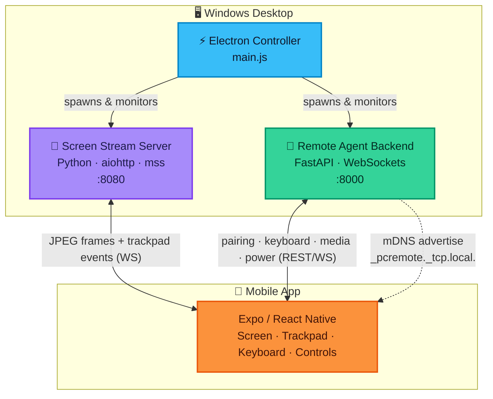

<div align="center">


<br/>


</div>


## ✨ Overview

**Vedi Pocket PC** turns your phone into a wireless trackpad, keyboard, and live screen for your desktop — streamed entirely over your **local Wi‑Fi**. No accounts, no cloud relay, no internet dependency. Pair with a QR code and you're in control.

<div align="center">
<table>
<tr>
<td align="center" width="25%">

### 🖥️
**Screen Mirror**
Low‑latency JPEG stream over WebSocket

</td>
<td align="center" width="25%">

### 🖱️
**Trackpad**
Move · Click · Drag · Scroll

</td>
<td align="center" width="25%">

### ⌨️
**Keyboard**
Soft keys + shortcut bar

</td>
<td align="center" width="25%">

### ⚡
**Power & Media**
Lock · Sleep · Shutdown · Volume

</td>
</tr>
</table>
</div>


## 🚀 Quick Start

### ⚡ Option A — 1-Click Setup (Recommended)

1. Double-click **[`setup.bat`](file:///P:/Vedi-Pocket-PC/setup.bat)** (or run `.\setup.bat` in PowerShell).
   - *Installs all Python requirements, Electron desktop dependencies, and Expo mobile app dependencies automatically.*
2. Double-click **[`start.bat`](file:///P:/Vedi-Pocket-PC/start.bat)** (or run `npm start`).
   - *Launches the desktop app controller, screen streaming server, remote backend agent, and Expo dev server.*
3. Open **Expo Go** on your phone and scan the QR code displayed on screen or printed in your terminal.

---

### ⚙️ Option B — Manual Setup & Step-by-Step Execution

<details>
<summary><b>Click to expand manual setup instructions</b></summary>

<br/>

**1️⃣ Install Master Python Libraries**
```powershell
pip install -r requirements.txt
```

**2️⃣ Install Root & Mobile Node Dependencies**
```powershell
npm install
cd veddi-pocketpc
npm install
cd ..
```

**3️⃣ Run Desktop & Backend Controller**
```powershell
npm start
```

**4️⃣ Manual Service Execution (Without Electron UI)**
If you want to run each service individually in separate terminal windows:

- **Screen Stream Server (Port 8080)**:
  ```powershell
  cd screen-stream-server
  python server.py
  ```
- **Remote Agent Backend (Port 8000)**:
  ```powershell
  cd vedi-pocketpc-backend
  python main.py
  ```
- **Mobile Client App (Port 8081)**:
  ```powershell
  cd veddi-pocketpc
  npx expo start -c
  ```

</details>


## 🧩 System Architecture




## 🗂️ Repository Structure

```text
Vedi-Pocket-PC/
├── setup.bat                          ⚡ One-click installer (Node + Python)
├── start.bat                          🚀 One-click launcher (Desktop + Backends)
├── requirements.txt                   📦 Master Python dependencies
├── controller/                        ⚡ Electron desktop controller & IPC
├── screen-stream-server/              📡 Screen capture & trackpad relay (:8080)
├── vedi-pocketpc-backend/             🔧 FastAPI remote agent & pairing (:8000)
├── veddi-pocketpc/                    📱 Expo / React Native mobile client (:8081)
└── packages/agent-core/               🧠 Shared Python core domain logic
```


## 🔧 Firewall & Port Troubleshooting

If your mobile app cannot connect to your PC, make sure your phone and PC are on the **same Wi‑Fi network**, and open the required ports in PowerShell (**as Administrator**):

```powershell
New-NetFirewallRule -DisplayName "Vedi Pocket PC - Screen Stream (8080)" -Direction Inbound -LocalPort 8080 -Protocol TCP -Action Allow -Profile Private,Domain
New-NetFirewallRule -DisplayName "Vedi Pocket PC - Backend Agent (8000)" -Direction Inbound -LocalPort 8000 -Protocol TCP -Action Allow -Profile Private,Domain
```

### Common Issues & Fixes
- **Port 8081 In Use**: If you see `Port 8081 is being used by another process`, close any separate `npx expo start` terminal windows before running `start.bat` or `npm start`.
- **Peer Dependency Conflicts**: `.npmrc` is configured to set `legacy-peer-deps=true` so `npm install` succeeds without dependency errors.


<div align="center">

### 📄 License

**MIT** — see `package.json`

</div>
